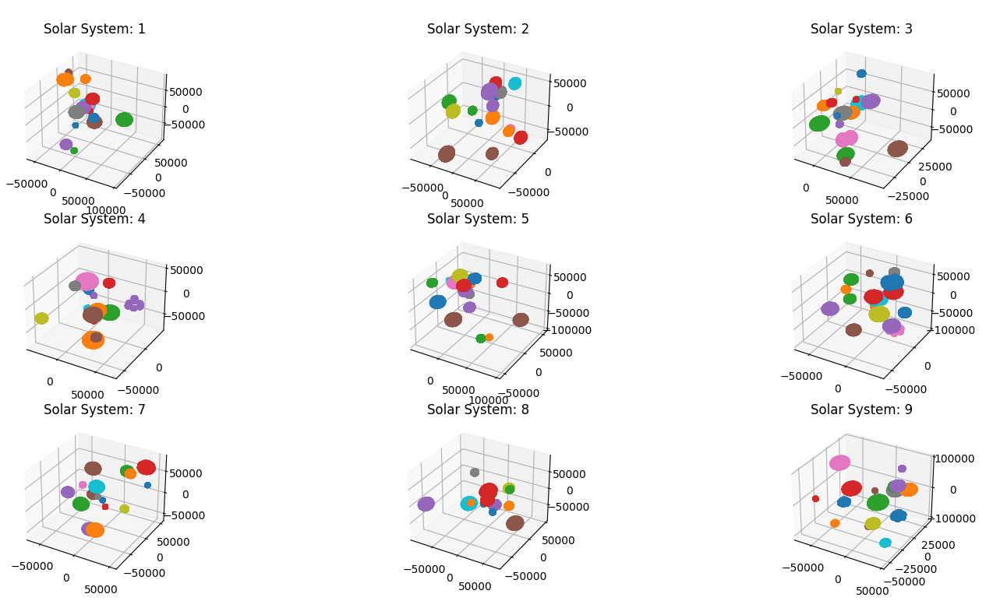

# FlatBuffer Library Demonstration

## Purpose
  Demonstrate encoding of data through the [FlatBuffer library](https://github.com/google/flatbuffers) in Python, and compare performance to a basic serialization method like JSON.

## Usage (Linux)
* Running `python main.py` from the root of this repository creates mock data of a galaxy, and then encodes/decodes it using the FlatBuffer library and through JSON
* The script saves files for the serialized data, prints run time statistics, and provides a visualization of the galaxies



## Results
FlatBuffer encoding proved to make serialized data that is much smaller in size than JSON, however - FlatBuffer encoding proved to add significant overhead at run-time. It would be interesting to see if the overhead would decrease if the implementation was done in C++ instead of Python.


## Details
### Mock Data Structure
The mock data being serialized represents a Galaxy with solar systems, as defined in the `Galaxy/` folder. The Galaxy follows a simple aggregation structure, with the majority of the data being the surface points of each space object. The properties are randomized at run time.


### Schema Definition and API
To serialize the mock objects, a FlatBuffer schema is defined in `GalaxySchema.fbs`. This schema is used to auto-generate the FlatBuffer API in the folder `GalaxySchema/`. The API calls are then implemented throughout the `GalaxyFlatBufferEncoder.py` logic, and are executed at runtime by the main application.

To generate the `GalaxySchema/` API folder, the FlatBuffer compiler is needed and can be downloaded from the [release page of the google/flatbuffers Github repository](https://github.com/google/flatbuffers/releases). Using this compiler:
* To generate `GalaxySchema/` FlatBuffer API run ```./flatc --python GalaxySchema.fbs```

### Output Data
The serialized data is saved to the `output/` folder, with a binary file created by the FlatBuffer API, and a plain text JSON file
* The FlatBuffer binary can be converter to json through following: ```./flatc --json --raw-binary GalaxySchema.fbs -- output/galaxy.bin```

## Resources
* [Flatbuffer tutorial with additional examples](https://flatbuffers.dev/flatbuffers_guide_tutorial.html)

## Future Work
* Implement FlatBuffer encoding in C++
* Investigate other encodings, such as Apache Parquet